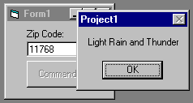



## Get current weather in ANY ZipCode\! \- FREE CONTROL\! \- Simply Place on your form, Call ONE Function\.

### Description

This Control will go out to the internet, connect to the host, and find the local weather conditions. This code can easily be altered to get the 5-Day Forecast, Temperature, etc..

Please Vote if you like it!
 
### More Info
 

             |
---                |---
**Submitted On**   |2000-08-14 15:17:58
**By**             |[Sparq](https://github.com/Planet-Source-Code/PSCIndex/blob/master/ByAuthor/sparq.md)
**Level**          |Intermediate
**User Rating**    |4.3 (13 globes from 3 users)
**Compatibility**  |VB 6\.0
**Category**       |[Custom Controls/ Forms/  Menus](https://github.com/Planet-Source-Code/PSCIndex/blob/master/ByCategory/custom-controls-forms-menus__1-4.md)
**World**          |[Visual Basic](https://github.com/Planet-Source-Code/PSCIndex/blob/master/ByWorld/visual-basic.md)
**Archive File**   |[CODE\_UPLOAD89518142000\.zip](https://github.com/Planet-Source-Code/sparq-get-current-weather-in-any-zipcode-free-control-simply-place-on-your-form-call-one-f__1-10680/archive/master.zip)

